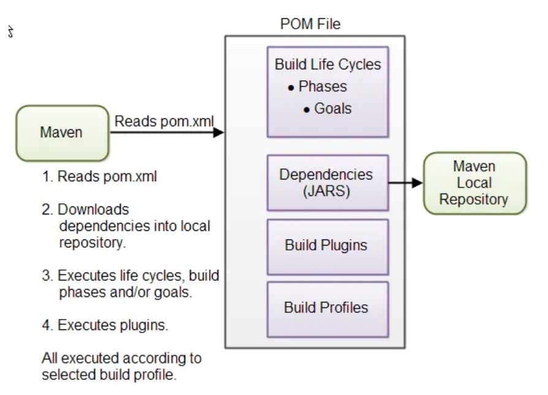

## Spring Boot Series
---
## Part 01: Introduction to Spring Boot 

**Steps:**

First we Create a Maven Project. We provide the Project Coordinates/Metadata (group ID, artifact ID, Name, Description, Package Name and version number(maybe if present) )

Secondly, add all the required dependencies. For this one, I have simply added Spring Web and Spring Boot DevTools but not used for now.

At last, now open the main HelloworldApplication.java and print "Hello World!";

Finally, Run As -> Java Application and Voila!

---

## Study Notes for future Reference

What is Maven?
- First of all, Maven is a Build automation tool (and a Project Management Tool) that is used to primarily manage and build java projects. Not only Java, it can also be used to build and manage projects written in C#, Ruby, Scala etc.

- It helps to manage dependencies, automate common tasks.

Why Maven?

- Instead of Manually downloading dependencies, maven handles it by reading a '*pom.xml*' file (PROJECT OBJECT MODEL) which lists all the dependencies our project needs.

- It automates process of compilation, testing , packaging our application (ex: into JAR (Java ARchive file) or WAR (Web Application aRchive) file)

Why Maven instead of Others like
Alternatives of Maven are:
     1. Gradle
     2. Ant(with Ivy)
     3. SBT(Scala Build Tools)
     etc.

First, Gradle's Advantages are :

- Gradle uses Groovy or Kotlin-based DSL (Domain-Specific Language) for its build scripts, which can be more powerful and flexible than Maven's XML-based configuration (pom.xml).
- Performance: If you’re working on a large project with complex builds, Gradle might offer better performance due to its incremental builds.
- Flexibility: If you need more flexibility and custom build logic, Gradle could be a better choice because of its powerful scripting capabilities.

Why Maven instead of Others?

- Convention Over Configuration: Maven follows a convention-over-configuration approach, which means it enforces a standard project structure and default behaviors. This reduces the need for custom configuration, making it easier for beginners.

## Additional Notes for In-Depth Knowledge:

### POM 

## Three-Build Lifecycle of Maven

Maven has three built-in build lifecycles:

### 1. Default Lifecycle
This is the main lifecycle that is executed when the `mvn` command is run without any additional phases specified. It includes the following phases:

- **validate**: Validate the project is correct and all necessary information is available.
- **compile**: Compile the source code of the project.
- **test**: Test the compiled source code using a suitable unit testing framework.
- **package**: Take the compiled code and package it in its distributable format, such as a JAR or WAR file.
- **verify**: Run any checks on the results of integration tests to ensure quality criteria are met.
- **install**: Install the package into the local repository for use as a dependency in other projects locally.
- **deploy**: Done in an integration or release environment, copies the final package to the remote repository for sharing with other developers and projects.

### 2. Clean Lifecycle
This lifecycle handles project cleaning. It includes the following phases:

- **pre-clean**: Execute processes needed prior to the actual project cleaning.
- **clean**: Remove all files generated by the previous build.
- **post-clean**: Execute processes needed to finalize the project cleaning.

### 3. Site Lifecycle
This lifecycle handles the creation of the project's site documentation. It includes the following phases:

- **pre-site**: Execute processes needed prior to the actual project site generation.
- **site**: Generate the project's site documentation.
- **post-site**: Execute processes needed to finalize the site generation and to prepare for site deployment.
- **site-deploy**: Deploy the generated site documentation to the specified web server.

---

## Incremental Builds in Gradle

Incremental builds in Gradle refer to a build process where only the parts of the project that have changed are rebuilt, rather than rebuilding the entire project from scratch. This can significantly speed up the build process, especially in large projects.

### What are Incremental Builds?

- **Traditional Build Process**: In traditional build tools like Ant (or even Maven to some extent), every time you build the project, the tool will compile all the source files, run all the tests, and package everything, regardless of whether there have been any changes.

- **Incremental Builds**: In an incremental build, the build tool checks which files have changed since the last build. It then only recompiles and reprocesses those changed files, skipping the parts of the project that haven’t changed. This makes the build process faster because it avoids unnecessary work.

### Why is This Important?

In large projects with thousands of files, building everything from scratch can take a long time. Incremental builds help speed up development by reducing the time developers spend waiting for builds to complete.

### Example of Incremental Build in Gradle

Let’s say you have a project with 100 Java files. You make a small change in one file and then run the build process.

- **Without Incremental Build**: The build tool would recompile all 100 files, rerun all tests, and package the entire application, even though only one file changed.
- **With Incremental Build**: Gradle would detect that only one file was modified. It would only recompile that single file, and only rerun tests that are affected by this change, making the process much faster.

### Why Does Gradle Have Better Incremental Builds?

Gradle is designed with incremental builds in mind. It has sophisticated mechanisms to track changes in files, configurations, and dependencies. This allows it to intelligently skip unnecessary steps in the build process, making it more efficient compared to Maven, which doesn’t have as advanced incremental build capabilities by default.

### Summary

In summary, incremental builds mean faster build times because only the changes in your project are rebuilt, rather than the entire project. This is one of the reasons why Gradle is favored in large projects or in scenarios where build speed is critical.

---

